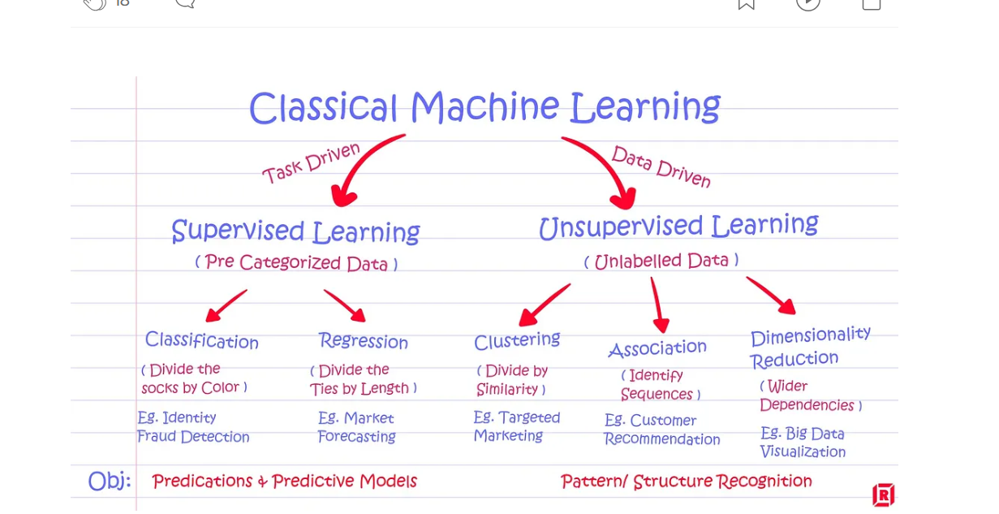

::: {.callout-tip icon="false"}
## Github Repo Link
[Sophie's L01 Review Link](https://github.com/stat301-3-2026-spring/l01-review-sophielangaigne2027-hash.git)
:::

### Question 1

Provide a brief outline/overview of the steps involved in a supervised machine learning process. Could provide this as a bulleted list. 

::: {.callout-tip icon="false"}
## Solution

Figure out where a problem is a classification or regression and what metric you might want to use. After we should clean the dataset and handdle it's missing values and encode categies using factor, etc. 

Next, we split the dataset into training and testing data and adding folds for resampling to reduce overfitting and improves model evaluation. Then we can choose the models that we would like to use to help us. We can then tune our hyperparameters to help balance underfitting and overfitting and also improve accuracy.

This leads us to training our models using our data and then evaluating these models by collecting our assessment metrics. Lastly, pick the best model based on the metrics. 

:::

### Question 2

Explain the difference between supervised and unsupervised learning.

::: {.callout-tip icon="false"}
## Solution

Supervised learning has a target variable that we are trying to predict an outcome about.

Unsupervised learning doesn't have a target variable of interest and we want to understand the structure of the data and extract information about that dataset. 

:::

### Question 3 

In general, we can classify a model by its purpose into 1 of the 3 categories below. Provide a brief description of the goals of these model classes.

#### Descriptive Models 

::: {.callout-tip icon="false"}
## Solution

Describe trends, relationships and characteristics of a dataset. These are used to understand the structure of a dataset. Linear models and Parametric models (parameters that are easier to explain) are examples of this. Summarize the dataset so that we have a better understanding of the problems that we may be dealing with when it comes to cleaning data.  

:::

#### Inferential Models

::: {.callout-tip icon="false"}
## Solution
Explains the how and the why of relationships between variable. We want to infer if relationships are statistically significant. Is this dataset casual or generalizable? What inputs effect outputs?. Parametric models. 

:::

#### Predictive Models

::: {.callout-tip icon="false"}
## Solution

Making a prediction of a variable based on other variables.  

:::

### Question 4 

We can further describe/classify predictive models by how they were derived or developed as being either mechanistic or empirically driven. 

#### Part (a)

What does it mean to be a mechanistic model?

::: {.callout-tip icon="false"}
## Solution
 
To be a mechanistic model, it means that it is built from theory or knowledge about a system or topic. Data is only used to estimate parameters so we can better predict.

:::

#### Part (b)

What does it mean to be an empirically driven model?

::: {.callout-tip icon="false"}
## Solution

When a model is empirically driven this means that our prediction is based on the dataset only and no theory or other knowledge. This means that predictions are other variables in the dataset and patterns in the data rather than outside formulas. 

:::

#### Part (c)

How does the mechanistic and empirically driven model terminology relate to the parametric and nonparametric model terminology? 

::: {.callout-tip icon="false"}
## Solution

Parametric models assume that there is a relationship between variables, meaning that the model has a fixed number of parameters to estimate. This means that estimation might be off for parametric models. The majority of mechanistic models are parametric because they are build off of theory and other knowledge like formulas meaning that variables are more likely to have direct relationsips. 

Nonparametric models dont assume that there is a relationship between variables and are built based on the data that is provided, meaning as there is more data there is more complexity within the data. Many empiricially driven models are nonparametric since it is not based on other knowledge or relationships between variables and anything we know about the dataset is based on patterns within the data. 

:::

#### Part (d)

In general, is a mechanistic or empirically driven model easier to interpret? Explain.

::: {.callout-tip icon="false"}
## Solution

Mechanistic models are much easier to interpret because there is less flexibility within the data and they are based on theory so there are clear explanations as to why the data is behaving in a certain way and why variables are interacting with one another before we even observe the data. In the contrary empirically driven models learn their structure from the data which is often time random, so the majority of the time it is more difficult to explain why the data may be behaving in a certain way. For these models we can see complexity between variables better but we also don't have a clear explanation as to why these variables are interacting in that way.   

:::

#### Part (e)

How does mechanistic and empirically driven model terminology relate to the idea of model flexibility? That is, which would be more or less flexible than the other.

::: {.callout-tip icon="false"}
## Solution

Empirically driven models are generally more flexible than mechanistic models since they dont assume relationships within the data and are made to adapt to the data. This is why they are able to capture more complexed relationships between variables. Mechanistic models are more fixed by theories, formulas and set information so they cant be as flexible. 
:::

#### Part (f)

Describe the bias-variance trade-off when considering the use of a mechanistic or empirically driven model. 

::: {.callout-tip icon="false"}
## Solution

Mechanistic models have high bias and low variance because they are fixed and may fail to capture the complexity of a relationship but they are also fixed meaning they are stable and dont vary as much based on data. 

Empirically driven models have low bias and high variance due to their flexibility. Because these models are only working based on the data provided their bias is significantly lower because data is often random but they have higher variance because they are sensitive to fluctuations in training data. This means that there is a high chance of overfitting and underfitting. 

:::

### Question 5 

Explain the difference between a regression and classification machine learning (ML) problems.

::: {.callout-tip icon="false"}
## Solution

Regression and Classification machine learning problems predict different types of variables. Regression problems predict continuous numeric values (quantitative) and Classification problems predict discrete categorical values (qualitative). 
:::

### Question 6 

When splitting the data, why is it useful to stratify by the outcome/target variable? 

::: {.callout-tip icon="false"}
## Solution

When splitting the data, it is useful to stratify by the target variable ensures that each subset of data training, validation and test has the same proportion of target distribution as the original dataset. This mean that the performance metrics will be representative of the dataset and bias will be reduced. 
:::

### Question 7 

Briefly describe how v-fold cross validation with repeats is used to estimate test RMSE. Also provide an explanation of why we use it. 

::: {.callout-tip icon="false"}
## Solution
When doing v-fold cross validation with repeats we split our dataset into folds so that we have a validation set and the model is trained on the rest of the folds. This helps reduce variability and we can get a better estimate of the model's test RMSE since we can take the average of all of the folds. This means with more folds we can get pieces of the dataset that are representative of our entire dataset and with more folds we will have many version we will have the best estimate to make generalizable statements about the dataset. 
:::

### Question 8

When might we use a bootstrap resampling procedure instead of v-fold cross validation to estimate test RMSE?

::: {.callout-tip icon="false"}
## Solution
Bootstrap resampling is when we sample without replacement from our dataset. When we have a smaller dataset we would be more likely to use bootstrap resampling instead of cross validation because we want to be able to use the most of the data in different ways since we dont have much to work with. In addition, we can get a better distribution of test metrics so we have a better idea of how well our model is doing. 

:::

### Question 9 

Briefly describe model tuning and why we use it.

::: {.callout-tip icon="false"}
## Solution

Model tuning is when we adjust a model's hyperparameters, such as learning rate, tree depth, or regularization strength to improve its performance. By changing hyperparameters and their ranges we can improve how well a model learns from our data and can improve generalizability. 

:::

### Question 10 

What are two common performance metrics when dealing with a regression ML problem?

::: {.callout-tip icon="false"}
## Solution
Two common performance metrics when dealing with a regression machine learning problem are RMSE and MAE. RMSE is the square root of the average of squared differences between predicted and actual values. This metric is important because it penalizes larger errors more heavily and shows when a model may be more off. MAE shows the absolute differences between predicted and actual values and can help show when a model's prediction is off and by how much it is off. 
:::

What are two common performance metrics when dealing with a classification ML problem?

::: {.callout-tip icon="false"}
## Solution
Two common performance metrics when dealing with a classification machine learning problems are accuracy and error rate. When we discuss accuracy we can also focus on true positives and negatives and false positives and negatives in confusion matrices that are used to calculate accuracy so we have a better understanding of where the model is suceeding and/or failing. Error rate can also help us understand how far off we may be when comes to our confidence that we predicted correctly. 

:::

### Question 11

Classify each question/problem below as either prediction or inferential. Explain your reasoning for each.

A company with a subscription based service (for example Netflix, Disney+, New York Times, etc) has data concerning customer interactions with a them, including features like the number of customer service calls, quality of service calls, subscription length, engagement with the service, discounted service, etc. They are interested in two questions:

1. Does a high number of service calls impact a customer's likelihood of churn in the next month (leave the company/drop the service)?

::: {.callout-tip icon="false"}
## Solution

This is an inferential problem because it is focused on the relationship between two variables service calls and churn and whether there is casuality between the two variables. 

:::

2. How likely is it that a customer will churn in the next month (leave the company/drop the service)?

::: {.callout-tip icon="false"}
## Solution

This is a prediction problem because it is trying to predict the probability that a customer will churn and its purpose to be as accurate as possible about what that probability will be. 

:::

Citations

OpenAI. (2023). ChatGPT (April 2023 version) [Large language model]. Retrieved April 5, 2026, from https://chat.openai.com/

Unsupervised and Supervised Learning
Katzman, D. "Supervised vs Unsupervised Learning and Use Cases for Each." Medium, https://medium.com/@dkatzman_3920/supervised-vs-unsupervised-learning-and-use-cases-for-each-8b9cc3ebd301.